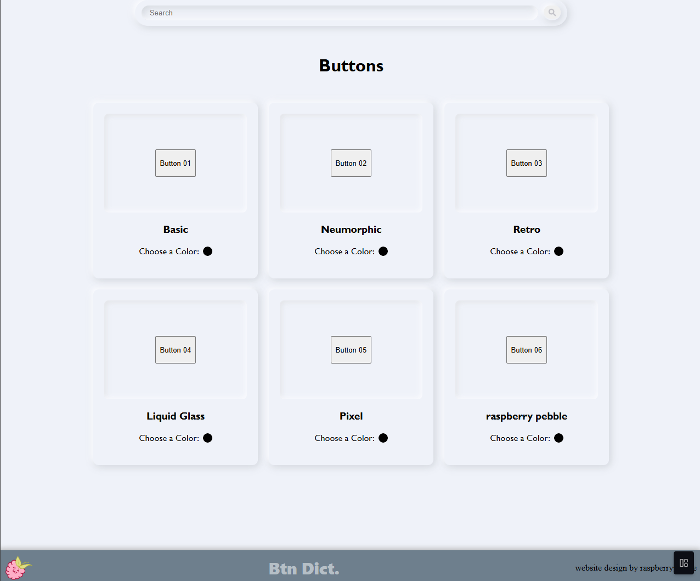

<head>
    <link rel="stylesheet" href="styles/readme.css">
    <link rel="preconnect" href="https://fonts.googleapis.com">
    <link rel="preconnect" href="https://fonts.gstatic.com" crossorigin>
    <link href="https://fonts.googleapis.com/css2?family=Archivo+Black&family=Bebas+Neue&family=Montserrat+Alternates:ital,wght@0,100;0,200;0,300;0,400;0,500;0,600;0,700;0,800;0,900;1,100;1,200;1,300;1,400;1,500;1,600;1,700;1,800;1,900&family=Roboto:ital,wght@0,100..900;1,100..900&family=Sen:wght@400..800&display=swap" rel="stylesheet">
</head>

<h1><mark>Button Dictionary</mark></h1>

A website displaying various button styles for reference in future projects. Built with HTML, CSS, and JavaScript. Each card displays a button with the option to alter the main color to fit your personal project.

<h3>Features</h3>
<ul>
    <li>Search function to view specific styles</li>
    <li>Color picker for integration into your own site</li>
</ul>

<h3>Thought Process</h3>

I am always eager to find the most aesthetic way to bring a project to life, so I thought it might be helpful to have a dictionary of different styles of a certain element. For this project, I am focusing on buttons. Buttons are really interesting to me because of how dynamic they are. From their inactive state, to their hover state, to their active state...it is really fun to watch how they change!

<h3>To Run</h3>
<ol>
    <li>Clone the repository!</li>
</ol>

<h3>How to Contribute</h3>
<form>
    <input type="checkbox" id="stepOne" name="stepOne">
    <label for="stepOne">HTML matches format already written</label>
     
    <input type="checkbox" id="stepTwo" name="stepTwo">
    <label for="stepTwo">Create a new branch, push changes to that branch, create a pull request</label>
     
    <input type="checkbox" id="stepThree" name="stepThree">
    <label for="stepThree">Unique CSS added to style the button</label>
     
    <input type="checkbox" id="stepFour" name="stepFour">
    <label for="stepFour">None of the other code is broken</label>
</form>

<h3>Preview</h3>

This is still a work in progress, therefore, there are some aspects and features that are not working properly at the moment.

